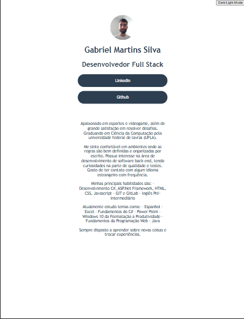
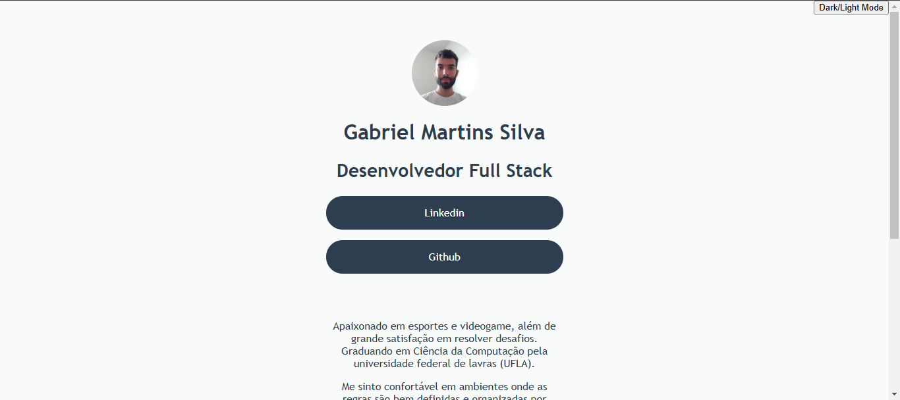
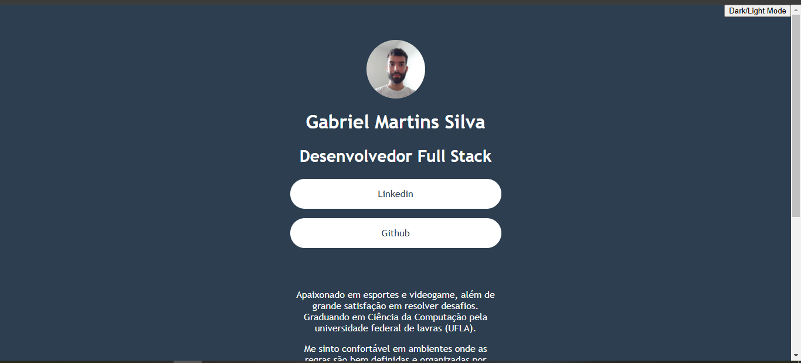

# Link Tree
[](https://github.com/gmartinssilva/linktree/blob/main/LICENSE)


# Sobre o projeto

Link para utilizar o projeto: [Netlify](https://linktreepersonal.netlify.app/)

Link Tree foi um projeto desenvolvido em uma live de 90 minutos, em um evento com a empresa [®Driven](https://www.driven.com.br/).

O objetivo do evento era demonstrar de maneira clara e didática, principalmente para as pessoas iniciantes e em transição de carreira, uma aplicação simples, somente
envolvendo os conceitos iniciais de programação Web, utilizando HTML, CSS e Javascript, além do editor de códigos online [Code Sandbox](https://codesandbox.io/).

Consiste basicamente em uma árvore de links com informações pessoais de uma pessoa. 

Para utilizar o projeto
não é necessário realizar a instalação de nenhuma biblioteca adicional, basta um navegador.

## Layout mobile
### Tela inicial

### Tela modo dark


## Layout web
### Tela inicial

### Tela modo dark


# Tecnologias utilizadas
- HTML
- CSS
- Javascript

# Como executar o projeto
```bash
# clonar repositório
git clone https://github.com/gmartinssilva/linktree.git

# Entrar na pasta do projeto e abrir o arquivo index.html no seu navegador
```

# Autor

Gabriel Martins Silva

https://www.linkedin.com/in/gabrielmartinssilva/

# Referências

[Badges](https://github.com/Ileriayo/markdown-badges)
